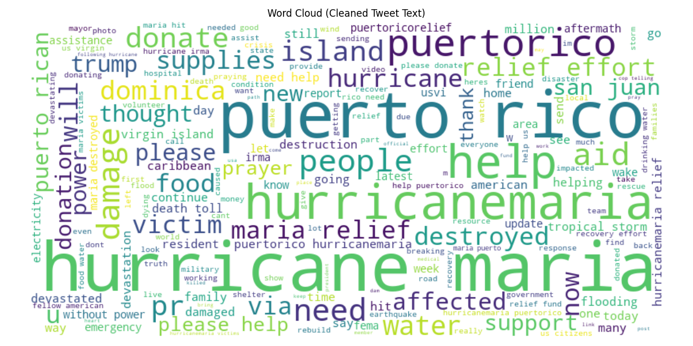
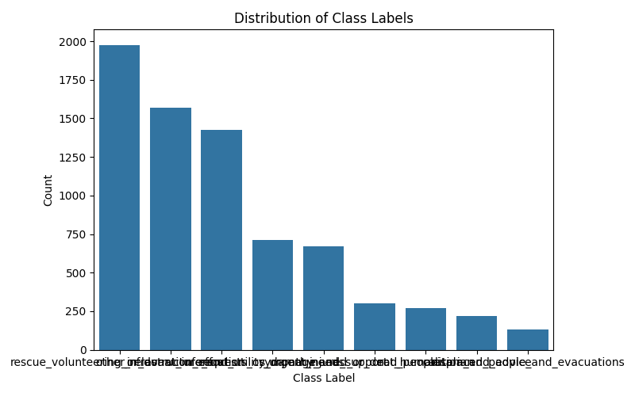
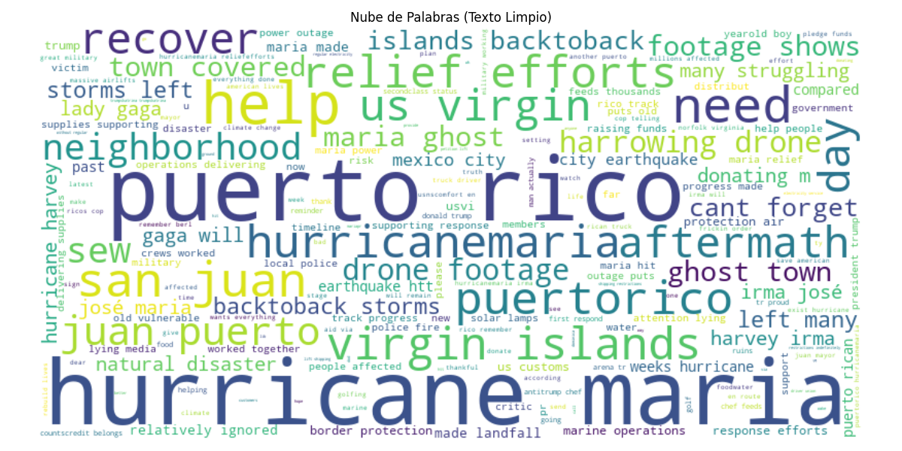
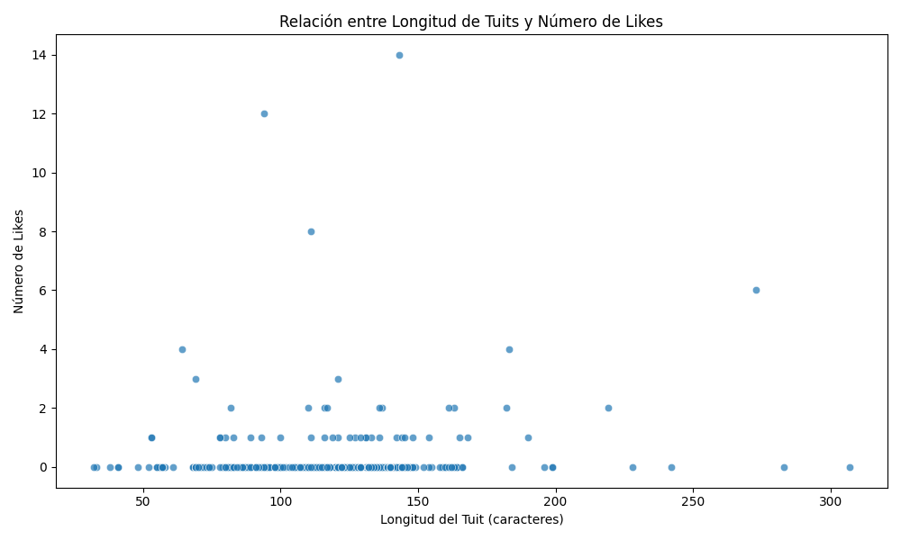
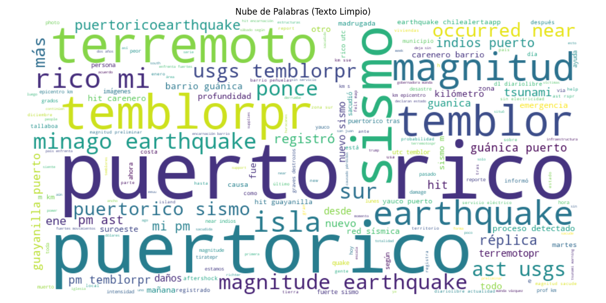
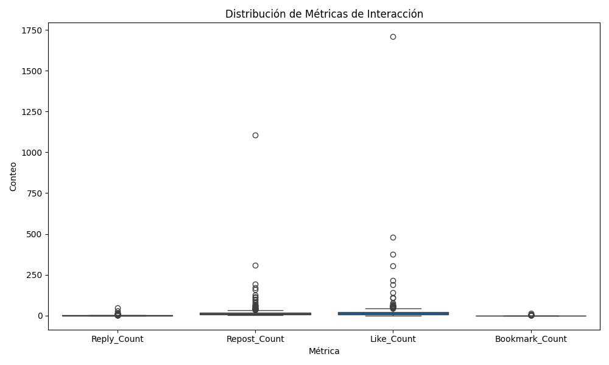
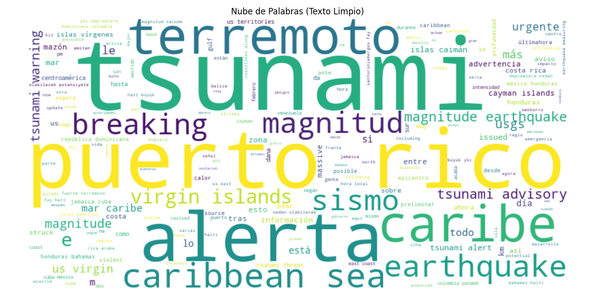
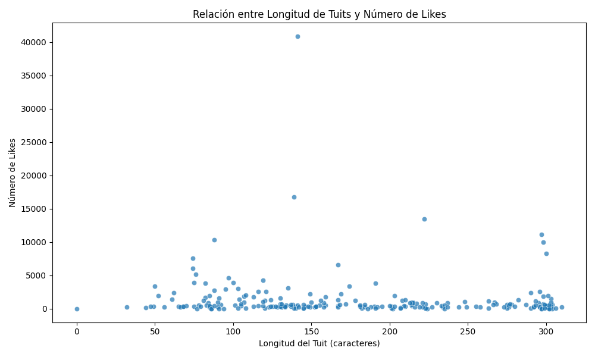

# PR-Disaster-Tweets: Analysis of Public Perception and Media Coverage During Natural Disasters in Puerto Rico

## Project Overview
This project focuses on analyzing public perception and media coverage during natural disasters in Puerto Rico, with a particular emphasis on Hurricane Maria (2017), the 2020 earthquakes, and 2025 tsunami advisory events. The analysis combines multiple datasets, including HumAID, ISCRAM18, and custom-scraped datasets, to provide insights into disaster response patterns, public sentiment, and humanitarian needs.

## Repository Structure
```
PR-Disaster-Tweets/
├── datasets/                  # All datasets used in the project
│   ├── HumAID_maria_tweets/   # HumAID dataset files for Hurricane Maria
│   ├── ISCRAM_maria_tweets/   # ISCRAM dataset files for Hurricane Maria
│   ├── PR_Earthquake_Tweets_Jan2020/ # Custom-scraped dataset for January 2020 earthquakes
│   └── PR_Advisory_Tweets_Feb_2025/  # Custom-scraped dataset for February 2025 tsunami advisory
├── .venv/                     # Virtual environment for dependencies
├── CITATION.md                # Citation information
├── LICENSE.md                 # License information
├── README.md                  # Project documentation
├── requirements.txt           # Python dependencies
```

## Dataset Details

### `/datasets/HumAID_maria_tweets/`
Contains annotated disaster data (hurricanes and earthquakes) from the [CrisisNLP HumAID Dataset (ICWSM 2021)](https://crisisnlp.qcri.org/humaid_dataset). This dataset includes approximately 7,300 tweets categorized into humanitarian themes and serves as the foundation for supervised thematic classification. Subcategories include:
- Caution and advice
- Displaced people and evacuations
- Infrastructure and utility damage
- Injured or dead people
- Not humanitarian
- Other relevant information
- Requests or urgent needs
- Rescue volunteering or donation effort
- Sympathy and support

### `/datasets/ISCRAM_maria_tweets/`
Includes files from the [ISCRAM 2018 dataset](https://arxiv.org/pdf/1805.05144) on Hurricane Maria. It contains approximately 1,000 tweets with tweet IDs. Since original dataset only contained tweet ID's, text was retrieved via hydration with [twikit](https://github.com/d60/twikit) to analyze public perception during the event. Visualizations include:
- Engagement metrics
- Likes distribution

### `/datasets/PR_Earthquake_Tweets_Jan2020/`
A custom collection of tweets related to the **January 2020 earthquakes in Puerto Rico**. This dataset includes approximately 300 tweets and enables comparisons between past disasters and current social media reactions. Data was scraped using [Octoparse](https://www.octoparse.com/) with filters for keywords, dates, and geolocation. Visualizations include:
- Interaction metrics
- Language distribution
- Likes distribution
- Tweet length histograms and boxplots
- Word clouds

### `/datasets/PR_Advisory_Tweets_Feb_2025/`
A custom collection of tweets related to the **February 2025 tsunami advisory**. This dataset includes approximately 250 tweets. It enables comparisons between past disasters and current social media reactions. Data was scraped using [Octoparse](https://www.octoparse.com/) with filters for keywords, dates, and geolocation. This dataset will be processed for sentiment analysis and misinformation detection. Visualizations include:
- Engagement metrics
- Language distribution
- Likes distribution
- Tweet length histograms and boxplots
- Word clouds

## Running the Analysis

### Setup and Installation

1. Clone the repository:
```bash
git clone https://github.com/marcoyuuu/PR-Disaster-Tweets.git
cd PR-Disaster-Tweets
```

2. Create a virtual environment (optional but recommended):
```bash
python -m venv venv
source venv/bin/activate  # On Windows: venv\Scripts\activate
```

3. Install dependencies:
```bash
pip install -r requirements.txt
```

### 📘 Jupyter Notebook (Unified Analysis)

A consolidated notebook, **`PR-Disaster-Tweets.ipynb`**, is available at the root of the project. This notebook brings together all analysis scripts and documentation in a single, executable format.

#### To run the notebook:

1. **Navigate to the project directory** (if not already there):
   ```bash
   cd PR-Disaster-Tweets
   ```

2. **Activate the virtual environment** (optional but recommended):
   ```bash
   source venv/bin/activate        # macOS/Linux
   venv\Scripts\activate           # Windows
   ```

3. **Install the required packages** (if not yet installed):
   ```bash
   pip install -r requirements.txt
   ```

4. **Launch Jupyter Notebook**:
   ```bash
   jupyter notebook
   ```

5. Open `PR-Disaster-Tweets.ipynb` in the browser interface or in IDE if possible and run the cells interactively to explore all datasets and visualizations in one place.

> This notebook is ideal for demonstrations, walkthroughs, and academic presentations of the entire project pipeline.
> It is also available as pdf 'PR-Disaster-Tweets.pdf'.

### Data Processing and Analysis

#### HumAID Dataset
```bash
cd datasets/HumAID_maria_tweets/analysis
python analyze_humaid.py
```

#### ISCRAM Dataset
```bash
cd datasets/ISCRAM_maria_tweets/analysis/
python analyze_ISCRAM_tweets.py
```

#### Earthquake Tweets (January 2020)
```bash
cd datasets/PR_Earthquake_Tweets_Jan2020/analysis/
python analyze_Jan2020_tweets.py
```

#### Advisory Tweets (February 2025)
```bash
cd datasets/PR_Advisory_Tweets_Feb_2025/analysis/
python analyze_Feb2025_tweets.py
```

## Example Visualizations

### HumAID Hurricane María Tweets Analysis
- **Tweet Word Cloud**: 
- **Class Label Distribution**: 

### ISCRAM Hurricane María Tweets Analysis
- **Tweet Word Cloud**: 
- **Length vs Likes**: 

### Earthquake Tweets (Jan 2020) Analysis
- **Tweet Word Cloud**: 
- **Interaction Metrics**: 

### Advisory Tweets (Feb 2025) Analysis
- **Tweet Word Cloud**: 
- **Length vs Likes**: 

## Project Context

Puerto Rico is highly vulnerable to hurricanes and earthquakes. While these events differ in nature, both generate significant media impact and intense social media responses. Public perception, misinformation spread, and emotional language during these events can vary greatly. This project aims to analyze and compare how Puerto Ricans react to hurricanes (e.g., Hurricane Maria) and earthquakes (e.g., January 2020 earthquakes) using social media text analysis, particularly on Twitter. This comparison will help identify communication patterns and risk perception differences for various threats.

## License
This project is licensed under the MIT License - see the LICENSE.md file for details.

## Acknowledgments
- HumAID dataset
- ISCRAM18 dataset
- Contributors and researchers involved in data collection and analysis

## Citation
Citations are included in CITATION.md file.