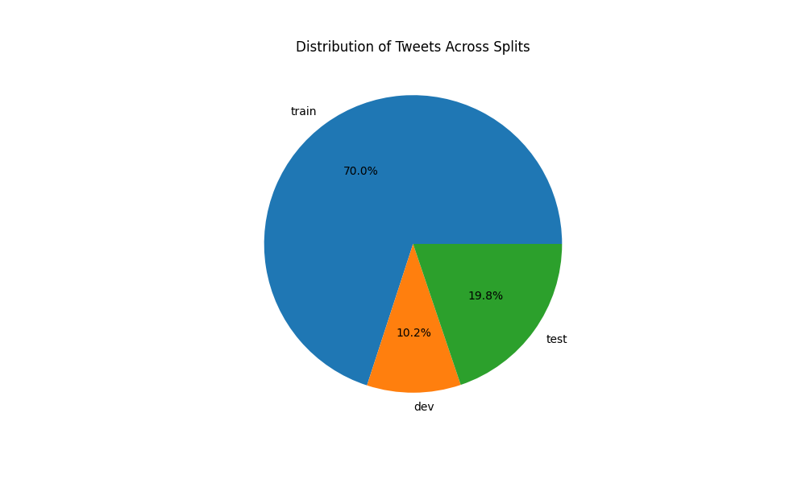
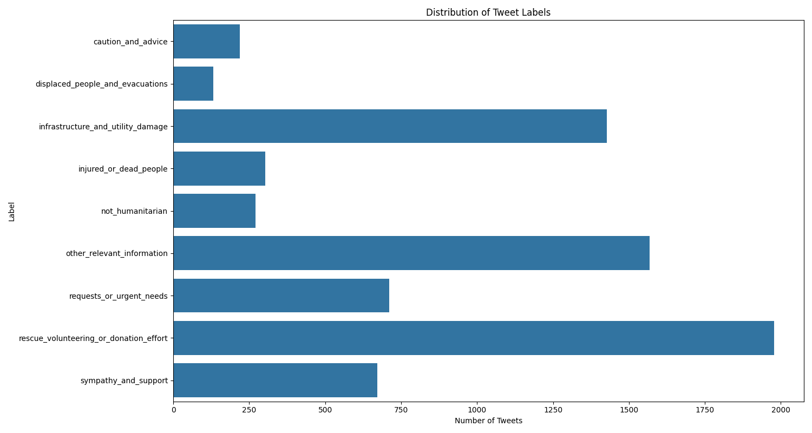

# Hurricane Maria Tweet Analysis

## Overview
Total tweets analyzed: 7278

## Data Split Distribution
| Split | Number of Tweets | Percentage |
|-------|-----------------|------------|
| train | 5094 | 70.0% |
| dev | 742 | 10.2% |
| test | 1442 | 19.8% |

## Label Distribution
| Label | Count | Percentage |
|-------|-------|------------|
| rescue_volunteering_or_donation_effort | 1977 | 27.2% |
| other_relevant_information | 1568 | 21.5% |
| infrastructure_and_utility_damage | 1427 | 19.6% |
| requests_or_urgent_needs | 711 | 9.8% |
| sympathy_and_support | 672 | 9.2% |
| injured_or_dead_people | 302 | 4.1% |
| not_humanitarian | 270 | 3.7% |
| caution_and_advice | 220 | 3.0% |
| displaced_people_and_evacuations | 131 | 1.8% |

## Visualizations
### Split Distribution

### Label Distribution

## Key Findings
### Most Common Tweet Categories:
- rescue_volunteering_or_donation_effort: 1977 tweets (27.2%)
- other_relevant_information: 1568 tweets (21.5%)
- infrastructure_and_utility_damage: 1427 tweets (19.6%)

### Infrastructure and Urgent Needs:
- Infrastructure damage related tweets: 1427
- Urgent needs related tweets: 711
- Combined: 2138 tweets (29.4% of total)
